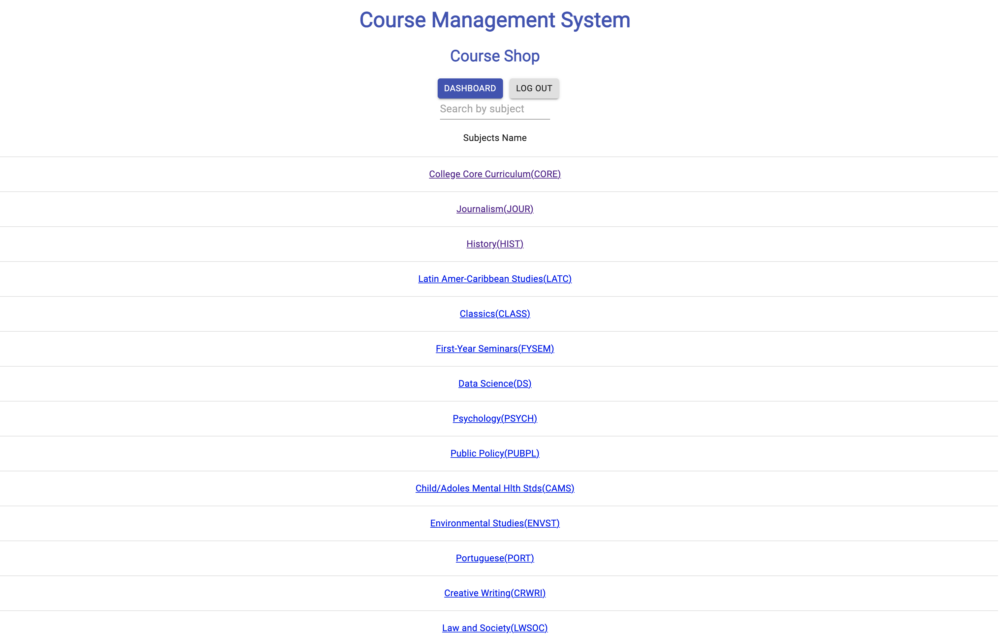

### [Course Management System](https://626ba005750337516f70bbad--luxury-dieffenbachia-ca0d95.netlify.app/) 
[](img/CMS.gif)
##### Backend
- API to register and login user.
- API using which loged in user can add, edit and update it's product.
- Pagination API to give list of perticular user's added product.
- JWT token authentication.

##### Frontend
- Creating a Component in React and creat routing.
- Using react and material UI created form to login user and can register new user.
- Course add and delete also you can search school, subject and course by name.
- Making HTTPS calls using Axios.
- Hyperlink to RateMyProfessor

### Prerequisites
Below noted things you need to install to run this project in your system

- Node.js
- NPM
- MongoDB

### To Setup
Clone or download this repository

1. `cd final-project-jiaweioi/backend`
2. `npm install`
3. `cd final-project-jiaweioi/frontend`
4. `npm install`
5. `modify the config.js in src to the backend server url`

### To Run
To run node server
1. `cd final-project-jiaweioi/backend`
2. `nodemon server.js`

To run react frontend
1. `cd final-project-jiaweioi/frontend`
2. `npm start`


## Overview
This is a course management system(CMS) with real time Albert courses data, you can add,delete,view RateMyProfessor easily through CMS. Your course data will store in MongoDB and can be viewed everywhere at anytime.

## Data Model

The application will store Users, and Courses

* users can have multiple Courses in dashboard
* each course can have multiple infomation


User:

```javascript
{
    userSchema = new mongoose.Schema({
        username: {type: String, required: true},
        password: {type: String},
        courses:  [{ type: mongoose.Schema.Types.ObjectId, ref: 'course' }],
    });
}
```

Course:

```javascript
{
    courseSchema = new mongoose.Schema({
        name:{type: String},
        deptCourseId: {type: String},
        description: {type: String},
        subjectCode: {
            code: {type: String},
            school: {type: String}
        },
        rmpUrl:{type: String},
        registrationNumber: {type: Number},
        code: {type: String},
        instructors: [],
        type: {type: String},
        status: {type: String},
        time: {type: String},
        recitations: [],
        waitlistTotal: {type: Number},
        instructionMode: {type: String},
        campus: {type: String},
        minUnits: {type: Number},
        maxUnits: {type: Number},
        grading: {type: String},
        location: {type: String},
        notes: {type: String},
        prerequisites: {type: String},
        subject:{type: String},
        school:{type: String},
        ID:{type: String}
    });
}
```


## [Link to Commented First Draft Schema](backend/model) 


## Wireframes


/ - dashboard - page for showing added courses


/shop/school - page for showing schools


/shop/subject - page for showing subjects



/shop/course - page for showing courses


## Site map


## User Stories or Use Cases


1. as non-registered user, I can register a new account with the site
2. as a user, I can log in to the site
3. as a user, I can open my personal dashboard
4. as a user, I can view and search all courese in the course shop
5. as a user, I can add courses to my dashboard
6. as a user, I can deleted courses from my dashboard

## Research Topics

* (5 points) Integrate user authentication
    * I'm going to be using passport for user authentication
    * And account has been made for testing; I'll email you the password
    * see <code>cs.nyu.edu/~jversoza/ait-final/register</code> for register page
    * see <code>cs.nyu.edu/~jversoza/ait-final/login</code> for login page
* (5 points) react.js
    * used react.js as the frontend framework; it's a challenging library to learn, so I've assigned it 5 points
* (5 points) get course data from NYU api
    * Use the course system api
    * To get course infromation from the api 

## [Link to Initial Main Project File](/backend/server.js) 

## Annotations / References Used

1. [passport.js authentication docs](http://passportjs.org/docs) 
2. [tutorial on react.js](https://reactjs.org/) 
3. [course system API](https://anypoint.mulesoft.com/exchange/portals/nyu-0/aa8378b5-ce36-4c80-94a1-2e6042908e1a.central-it/course-sys-api/) 